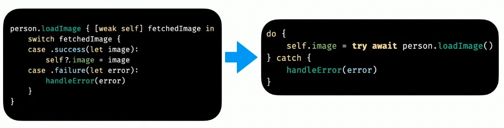
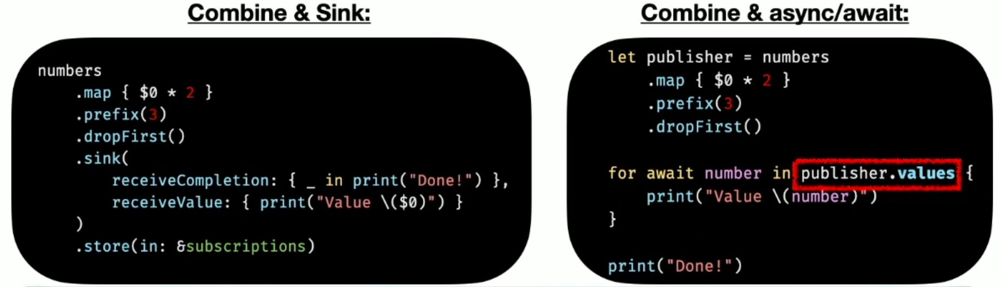

# Swift Concurrency

Explore the power of Swift Concurrency in this in-depth article. Learn how to harness its capabilities to write more efficient and responsive code for your Swift projects.

# Table of Contents

1. [Concurrency](#concurrency)
    1. [Concurrency vs Parallelism](#concurrency_parallelism)
    1. [Serial Execution vs Concurrent Execution](#serial_vs_concurrent)
1. [Swift pre-`async`/`await`](#pre_async_await)
    1. [Fetching and Updating a Single Resource Using Closures](#fetch_single_resource_closures)
    1. [Fetching and Updating Multiple Resources Using Closures (Waiting)](#fetch_multiple_resource_closures_waiting)
    1. [Fetching and Updating Multiple Resources Using Closures (Parallel)](#fetch_multiple_resource_closures_parallel)
        1. [Dispatch Groups](#dispatch_groups)
        1. [Dispatch Groups Template](#dispatch_groups_template)
1. [Swift `async` / `await`](#swift_async_await)
    1. [How does Swift Concurrency work?](#swift_concurrency_working)
    1. [How does `async`/`await` work?](#async_await_working)
    1. [`async` & `async throws`](#async_throws)
    1. [`await` &  `try await`](#try_await)
    1. [Where Can We Call an `async` Function? Asynchronous Context.](#asynchronous_context)
1. [`async` / `await` in Action](#async_await_in_action)
    1. [Fetching and Updating Multiple Resources Using `async` / `await` (Waiting)](#fetching_multiple)
    1. [Fetching and Updating Multiple Resources Using `async let` Bindings (Parallel)](#fetch_multiple_resource_async_parallel)
    1. [Error handling using `try await`](#error_handling)
    1. [Async getters: `get async throws`](#async_getters)
    1. [Task](#task)
        1. [Creating tasks that inherit context, taks values, etc.](#task_init)
        1. [Creating tasks that are detached (independent)](#task_init_detached)
    1. [Cancellation](#cancellation)
        1. [`try Task.checkCancellation`](#cancellation_check_cancellation)
        1. [`if Task.isCancelled`](#cancellation_is_cancelled)
        1. [`try await withTaskCancellationHandler`](#cancellation_handler)
    1. [Many Async Requests](#many_async)
        1. [One Async Request At The Time (Serial)](#many_async_1)
        1. [`async let` Bindings (Concurrent)](#many_async_2)
        1. [Task Groups (Concurrent)](#many_async_3)
1. [Structured vs Unstructured Swift Concurrency](#structured_unstructured_swift_concurrency)
    1. [Structured Swift Concurrency](#structured_swift_concurrency)
    1. [Unstructured Swift Concurrency](#unstructured_swift_concurrency)
1. [Async Sequences](#async_sequences)
    1. [New `bytes` API for URL Requests](#async_sequences_bytes_urls)
    1. [New `bytes` API for Files](#async_sequences_bytes_files)
    1. [`AsyncSequence` Protocol](#async_sequences_protocol)
    1. [`AsyncStream` - the Implementation of `AsyncSequence` Protocol](#asyncstream)
1. [Actors](#actors)
    1. [What is a Data Race and how to prevent it?](#data_races)
    1. [Actors definition](#actors_definition)
    1. [Example: shared mutable state with and without an actor](#actors_example)
    1. [`@MainActor`](#main_actor)
1. [Using `async/await` in Existing Code Bases](#async_await_in_code_bases)
    1. [Create `async/await` Functions by Wrapping Closure-based Functions and Reusing Them](#async_await_wrapping_closures) 
    1. [Objective-C Interoperability](#objective_c)
    1. [SwiftUI](#swiftui)
    1. [Combine](#combine)
1. [TODO](#todo)
1. [References](#references)

# Concurrency <a name="concurrency"></a>

"Concurrency" - the ability to execute more than one program/task simultaneously.

## Concurrency vs Parallelism <a name="concurrency_parallelism"></a>

Rob Pike said:
- Concurrency is about dealing with many things at once, parallelism is about doing many things at once. 
- Concurrency is a way to structure things so you can maybe use parallelism to do a better job.

## Serial Execution vs Concurrent Execution <a name="serial_vs_concurrent"></a>

# Swift pre-`async`/`await` <a name="pre_async_await"></a>

- Grand Central Dispatch
- Completion handlers
- Combine

## Fetching and Updating a Single Resource Using Closures <a name="fetch_single_resource_closures"></a>

- Synchronous - blocks the current thread, not efficient.
- Asynchronous - does not block the current thread.


## Fetching and Updating Multiple Resources Using Closures (Waiting) <a name="fetch_multiple_resource_closures_waiting"></a>

<br/>


## Fetching and Updating Multiple Resources Using Closures (Parallel) <a name="fetch_multiple_resource_closures_parallel"></a>

### Dispatch Groups <a name="dispatch_groups"></a>

<br/>


### Dispatch Groups Template <a name="dispatch_groups_template"></a>

```swift
let group = DispatchGroup()
var result1: Int?
var result2: Int?
var result3: Int?

/* ... */

group.enter()
repository.fetch1 { result1 in
    defer { group.leave() }
    
    // Do something with result1
    result1 = result1
}


group.enter()
repository.fetch2 { result2 in
    defer { group.leave() }
    
    // Do something with result2
    result2 = result2
}


group.enter()
repository.fetch3 { result3 in
    // Do something with result3
    result3 = result3
}

group.notify(queue: DispatchQueue.main) { [weak self] in
    // Do something with result1, result2, result3
}
```

# Swift `async` / `await` <a name="swift_async_await"></a>

## How does Swift Concurrency work? <a name="swift_concurrency_working"></a>

Swift Concurrency uses a **Cooperative Thread Pool** model:
- A **pool of threads** available to run asynchronous functions.
- There is one rule for Tasks:
    - **Tasks** must always **make forward progress** or **suspend**.
        - You can't block the thread or add a lock and never unlock.
        - Thanks to `Continuation`: can **suspend** and **resume** Tasks later to prioritize other, more important, pieces of work.
- No more than **one thread per CPU core** (as opposed to GCD).
    - Helps to avoid **Thread Explosion** by limiting the number of threads per queue so that they don't exceed the number of CPU cores.
    - Avoid the overhead and performance penalty of **thread switching** (`Continuation`).

## How does `async`/`await` work? <a name="async_await_working"></a>

**Marking a function as `async`:**
- Swift knows it can "give up the thread".
- "Give up the thread":
    - Function can **suspend**, **wait** for results, and then **resume** as needed.
    - It lets other `async` functions utilize threads in the Cooperative Thread Pool.

**Marking a function as `await`:**
- Swift can (possibly) **suspend** the function or **immediately run**:
    - It depends on thread availability and priorities.
- When it finishes, the parent function resumes - it may resumes on any thread.

This results in:
- Optimum CPU utilization (e.g. all your threads are busy, all high priority work get executed).
- Prevents Thread Hopping (It implies that a thread is quickly switching between multiple threads or tasks, often in a non-deterministic or unpredictable manner).
- Prevents Over-committing Threads (a situation where more threads are created or allocated than the system can efficiently handle simultaneously).


## `async` & `async throws` <a name="async_throws"></a>

`async`:
- Lets you **define asynchronous functions**.


## `await` &  `try await` <a name="try_await"></a>

`await`: 
- Lets you **wait** for **the results** of an **asynchronous function**.
- It also marks a **suspension point** (indicates that your async function might suspend there).



## Where Can We Call an `async` Function? Asynchronous Context. <a name="asynchronous_context"></a>

We can call `async` function from within an **asynchronous context**:
1. A task - new asynchronous context.
2. Other `async` function.


# `async` / `await` in Action <a name="async_await_in_action"></a>

## Fetching and Updating Multiple Resources Using `async` / `await` (Waiting) <a name="fetching_multiple"></a>

Each of `await` calls:
- **Suspends** the thread.
- **Waits** for its **result**.
- **Resumes** to the next steps after getting the result.


## Fetching and Updating Multiple Resources Using `async let` Bindings (Parallel) <a name="fetch_multiple_resource_async_parallel"></a>

`async let` bindings:
- Let you run multiple independent tasks in parallel.
- Awaits for all of their results together.

It simplifies code with Dispatch Groups from <a href="#fetch_multiple_resource_closures_parallel">Fetching and Updating Multiple Resources Using Closures (Parallel)</a>.


## Error handling using `try await` <a name="error_handling"></a>


## Async getters: `get async throws` <a name="async_getters"></a>


## Task <a name="task"></a>

- A **unit of asynchronous work**.
- Could be a **child of a different Task**.
- It's a generic over `Success` and `Failure`.
    - But the default for most common scenarios is `Void` and `Never`.
- It exposes an await-able **value** getter.


### Creating tasks that inherit context, taks values, etc. <a name="task_init"></a>


### Creating tasks that are detached (independent) <a name="task_init_detached"></a>


## Cancellation <a name="cancellation"></a>

- Task might have been cancelled by the time fetching the data finished. 
- `async / await` uses "Cooperative Cancellation" mechanism for cancellation.
- It means that each task is responsible to short-circuit its own execution if it's cancelled.

### `try Task.checkCancellation` <a name="cancellation_check_cancellation"></a>

- Use `try Task.checkCancellation` after `try await`:
    - It throws a special `CancellationError` if the task was cancelled
    - Stops the control flow


### `if Task.isCancelled` <a name="cancellation_is_cancelled"></a>

- Sometimes, if the task was cancelled, you want to perform different flow.
- You can use `Task.isCancelled` to check the condition.


### `try await withTaskCancellationHandler` <a name="cancellation_handler"></a>

- You can also have a closure executed upon Task cancellation.
- Good for performing clean-up like clearing the cache.


## Many Async Requests <a name="many_async"></a>

### One Async Request At The Time (Serial) <a name="many_async_1"></a>

- It's serial, suspends and waits for each image in its turn, not very efficient.


### `async let` Bindings (Concurrent) <a name="many_async_2"></a>

- It isn't useful when we're talking about variable amount of async functions.


### Task Groups (Concurrent) <a name="many_async_3"></a>

- It groups other child  task in a single parent task.
- Problem: results might return in any order.
- Consists of three parts:
    - `await withTaskGroup(of: ) { group in /* ... */ } ` / `await withThrowingTaskGroup(of:)` 
    - `group.addTask(priority: operation: { await /* ... */ })`
    - `for await result in group { /* ... */ }`


Without priorities:


With priorities:


With keeping track of different tasks:


# Structured vs Unstructured Swift Concurrency <a name="structured_unstructured_swift_concurrency"></a>

## Structured Swift Concurrency <a name="structured_swift_concurrency"></a>
- When we walk about Structured Concurrency, we talk about hierarchy.
- Having this dependency hierarchy lets Swift do smart things like propagate cancellation to child tasks.
- Examples:
    - Task Groups: 
        - Parent task: `TaskGroup<UIImage>`
        - Child tasks: `Task<UIImage, Never>`
    - `async let` Bindings

## Unstructured Swift Concurrency <a name="unstructured_swift_concurrency"></a>
- Tasks that are independent, not tight to other piece of work.
- Tasks don't have parent task.
- We cna store them, cancel them or interact with them later.
- Examples:
    - `Task { /* ... */ }`
    - `Task.detached { /* ... */ }`

# Async Sequences <a name="async_sequences"></a>

**Asynchronous work** might return **different results**:
- A **single** value:
    - Examples: `async / await` from the functions above. 
- **Multiple** values:
    - Examples: Sockets, Publishers, File Handles, URL Requests.
    - Prime use case for Async Sequences.
    - In Swift:
        - `AsyncSequence` Protocol.
        - `AsyncStream` - the Implementation of `AsyncSequence` Protocol.

## New `bytes` API for URL Requests <a name="async_sequences_bytes_urls"></a>

**Problem:**
- Fetch large CSV file from a URL and process it.

**Naive solution:**

- Fetch the entire file.
- Parse it as a single large `String` and split into lines.
- Iterate over all its available lines.


**New `bytes(for:)` / `bytes(from:)` API solution:**

- Process the line lazily, while the data transfer is ongoing.


## New `bytes` API for Files <a name="async_sequences_bytes_files"></a>

**Problem:**
- Load large CSV file from a file system and process it.

**Naive solution:**

- Read the entire file synchronously.
- Parse it as a single large `String` and split into lines.
- Iterate over all its available lines.


**New `bytes` on `FileHandle` API solution:**

- Read lines one-by-one using the new bytes API on `FileHandle`


## `AsyncSequence` Protocol <a name="async_sequences_protocol"></a>
- Similar to `Sequence`, except every value is **awaited asynchronously**.
- Example: a group object in `for await` from Task Groups examples. 
- We get to the result when the entire collection of work is done.
- Built-in methods that leverage Async Sequences for:
    - URL Requests
    - Files
- You don't have to implement it yourself, you can simply use `AsyncStream`.

## `AsyncStream` - the Implementation of `AsyncSequence` Protocol<a name="asyncstream"></a>


# Actors <a name="actors"></a>

## What is a Data Race and how to prevent it? <a name="data_races"></a>

**Data races occur when:**
- Usually involves **shared mutable state**.
- **Two (or more) threads** concurrently **access** the same **data**.
- One of these accesses is **a write / mutation**.

**Result of a data race:**
- One of these thread gets a wrong result.
- A crash

**How to prevent data races in shared mutable state?**
- Leverage synchronization mechanisms:
    - Atomics.
    - Locks (`NSLock`, `NSRecursiveLock`, `os_unfair_lock`, `Mutex`).
    - Serial dispatch queues.

## Actors definition <a name="actors_definition"></a>

- Actors are **reference type** objects (like classes).
    - They can have properties, methods, initializers, subscripts, and so on.
    - They can conform to protocols and be augmented with extensions.
- Actors provide **synchronization** for its **shared mutable state** (synchronous read/write).
    - Calls within an actor are synchronous.
- Actors provide **isolation** from the rest of the program for its **shared mutable state**.
    - The only way to access that state is by going through the actor.
- Whenever you **interact with an actor** from the outside, you must access the data **asynchronously**.
    - Use `await` before a function call.
- Actors **eliminates data races** on the actor's state.

## Example: shared mutable state with and without an actor <a name="actors_example"></a>

**Without an actor:**


**With an actor:**


## `@MainActor` <a name="main_actor"></a>

- It represents the Main Thread.
- `MainActor.run` = `DispatchQueue.main.async`
- You can annotate classes and functions with `@MainActor` to make sure they always run on the Main Thread.
    - It's common for a view models or a view controller.
    - You can opt-out specific methods so they don't run on the main actor by marking them as `nonisolated`.


# Using `async/await` in Existing Code Bases <a name="async_await_in_code_bases"></a>
- Deployment Target = iOS 13 (built into SDK iOS 15, back-deployed in older iOS versions).

## Create `async/await` Functions by Wrapping Closure-based Functions and Reusing Them <a name="async_await_wrapping_closures"></a>

Given a closure-based function you can wrap it as an async function.
- You can create your won `Continuation` by using these built-in functions:
    - `await withCheckedContinuation { continuation in /* ... */ }`
    - `try await withCheckedThrowingContinuation  { continuation in /* ... */ }`
    - `await withUnsafeContinuation { continuation in /* ... */ }`
    - `try await withUnsafeThrowingContinuation { continuation in /* ... */ }`
- Warning: you mustn't resume the continuation more than once. It results in unpredictable behavior.


## Objective-C Interoperability <a name="objective_c"></a>

- For Objective-C, the Swift Compiler automatically generates async versions of block-based methods.
- You can update their names by using `NS_SWIFT_ASYNC_NAME`.

## SwiftUI <a name="swiftui"></a>

- To execute async functions in SwiftUI code use `.task` modifier (iOS 15+).
    - It takes care of cancelling your task when you exit your view.
    - It can be stimulated in iOS 13 (but you have to handle cancellation on your own).


## Combine <a name="combine"></a>

- `AsyncSequence` similar to `Publisher` `values` property in `for await loop`.
- *swift-async-algorithms* library - a set of Combine-like operators for `AsyncSequence`s



# TODO <a name="todo"></a>
- @Sendable
- @globalActor
- @preconcurrency
- nonisolated
- Using Thread Sanitizer with Actors
- Atomics in Swift (?)
- How to cancel Task?

# References <a name="references"></a>
- [A crash course of async await (Swift Concurrency) - Shai Mishali - Swift Heroes 2022](https://www.youtube.com/watch?v=uWqy5KZXSlA)
- [Swift Concurrency by Example](https://www.hackingwithswift.com/quick-start/concurrency)
- [WWDC Swift Notes - Protect mutable state with Swift actors](https://www.wwdcnotes.com/notes/wwdc21/10133/)
